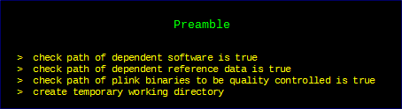
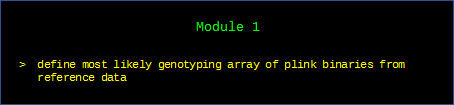
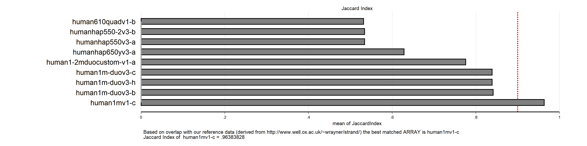
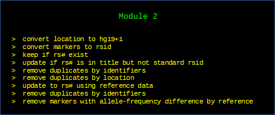
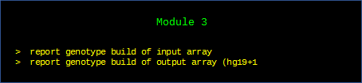
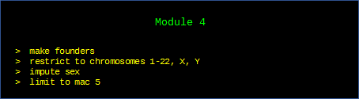
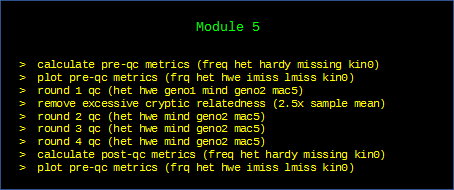
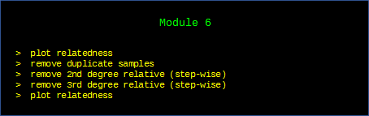
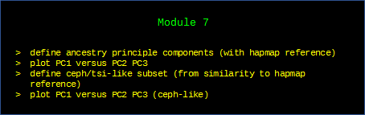
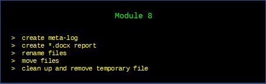

# Title
 - a program that imports a plink binary file and performs a genotype quality control, creating cleaned plink binaries, ceu-like classifiers and meta-log / docx output reports. 
# Installation
```net install genotypeqc,                from(https://raw.github.com/ricanney/stata/master/code/g/) replace```
# Syntax
```genotypeqc, param(<parameter_file>)```
# Description
This program runs a 'single-line-code' quality control of genotype array data utilising ```plink``` and ```plink2``` within ```stata```. Due to the complexity of the analysis the program utilises numerous reference file requires and other dependencies; these need to be noted in a parameters file. 
## Create a parameters file
The pipeline requires a number of dependencies and thresholds to be defined within a parameters file. The parameter file is basically a set of globals that ```stata``` stores in memory and applies during the qc program

> note that as of 16th November, the parameter file has become streamlined, removing annotation and becoming in essence a \*.do file

### Definitions
* ```array_ref``` the path to the folder containing the genotype array folders;
* ```build_ref``` the path to the file ```rsid-hapmap-genome-location.dta```
* ```kg_ref_frq``` the path to the file ```eur-1000g-phase1integrated-v3-chrall-impute-macgt5-frq.dta```
* ```hapmap_data``` the path to the plink binaries files for hapmap3-all-hg19-1
* ```aims``` the path to the file ```hapmap3-all-hg19-1-aims.snp-list```
* ```data_folder``` the path to the folder containing the plink binaries to be qc'd
* ```data_input``` the name of the plink binaries to be qc'd
* ```rounds``` the number of rounds of quality contro to be applied (4)
* ```hwep``` the max. hwe deviation in control samples to be tolerated (-log10(p)) (10)
* ```hetsd```  the max. heterozygosity standard deviation from the mean (4)
* ```mind``` the max. missingness per individual to be tolerate (0.02)
* ```geno1``` the max. missingness per SNP to be tolerated (first round) (0.05)
* ```geno2 ``` the max. max. missingness per SNP to be tolerated (final) (0.02)
* ```kin_d``` the min. kinship releationship for duplicates (0.354)
* ```kin_f``` the min. kinship releationship for 1st degree relatives (0.1770)
* ```kin_s``` the min. kinship releationship for 2nd degree relatives (0.0884)
* ```kin_t``` the min. kinship releationship for 3rd degree relatives (0.0442)
### An example parameter file
```
*an example parameter file
global array_ref   "E:\sandbox\example-data\genotyping-arrays\data"
global build_ref   "E:\sandbox\example-data\genome-builds\data\rsid-hapmap-genome-location.dta" 
global kg_ref_frq  "E:\sandbox\example-data\genotypes\1000-genomes\phase1\data\hg19\eur-1000g-phase1integrated-v3-chrall-impute-macgt5-frq.dta"
global hapmap_data "E:\sandbox\example-data\genotypes\hapmap\data\all\hg19-1\hapmap3-all-hg19-1"
global aims        "E:\sandbox\example-data\genotypes\hapmap\data\all\hg19-1\hapmap3-all-hg19-1-aims.snp-list"
global data_folder "E:\sandbox\example-data\genotypes\example" 
global data_input  "example" 
global rounds      4
global hwep        10
global hetsd       4
global maf         0.01
global mind        0.02
global geno1       0.05
global geno2       0.02
global kin_d       0.3540
global kin_f       0.1770
global kin_s       0.0884
global kin_t       0.0442
*the end of the example parameter file
```
## What is happening under the bonnet?
Although this is a single line of code, it is important to understand what is happening under the bonnet of the code. The code is split into mini modules each performing an important role in the qc.





It is rare to know specifically which array was used to genotype the sample. Often shorthand is used and can introduce some problems in downstream analyses. For example, researchers may call the array the psych-chip or immuno-chip or illumin 1M array without realising that multiple versions of these arrays exist. Using a set of \*.dta files created from Will Rayners' resource (http://www.well.ox.ac.uk/~wrayner/strand/), this module merges against the \*.bim file and calculates a match based on common rsid. 


```
* example head of *.dta file
rsid	chr	bp
AFFX-SNP_10021569	2	106584554
AFFX-SNP_10026879	16	82323721
AFFX-SNP_10029725	14	35532970
AFFX-SNP_10034687	18	65000314
AFFX-SNP_10036267	11	58562418
AFFX-SNP_10037362	20	2628109
AFFX-SNP_10037636	3	82820079
```



For imputed data we use a workaround and create a "dummy" array based on the imputation reference; see below

```
qui { // define reference name 
 global imputation_reference michigan-imputation-server-v1.0.3-hrc-r1.1-2016
 }
qui { // create dummy folder
 !mkdir ${array_ref}\\${imputation_reference}
 cd ${array_ref}\\${imputation_reference}
 }
qui { // create dummy array reference
 import delim using ${data_folder}\\${data_input}.bim, clear
 keep v1 v2 v4
 for var v1 - v4 : tostring X, replace
 rename (v1 v2 v4) (chr rsid bp)
 save ${imputation_reference}.dta, replace
 }
```
















# data-repositories
to run genotypeqc download the following archive;
* https://www.dropbox.com/s/u7s9su44beda710/sandbox.tar.gz?dl=0 - archive
* https://www.dropbox.com/s/4q1oh1nsxhnoww5/sandbox.tar.gz.md5?dl=0 - md5
